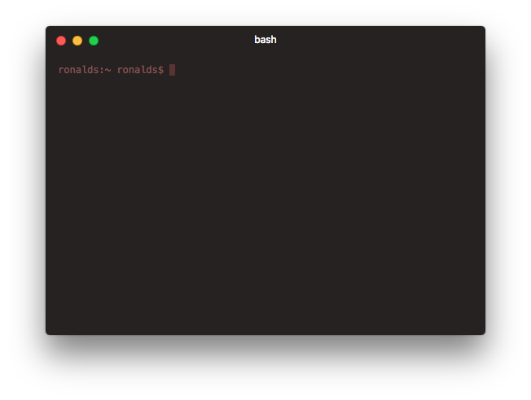

# Dark theme for HyperTerm




### Install

1. Open `~/.hyperterm.js`) with your editor.
2. Add `hyperterm-dark` to plugins list:
  
  ```js
localPlugins: [
'hyperterm-dark'
  ]
```
3. Add folder `hyperterm-dark` to `/.hyperterm_plugins/local`.
3. Update HyperTerm plugins.

### License

MIT
